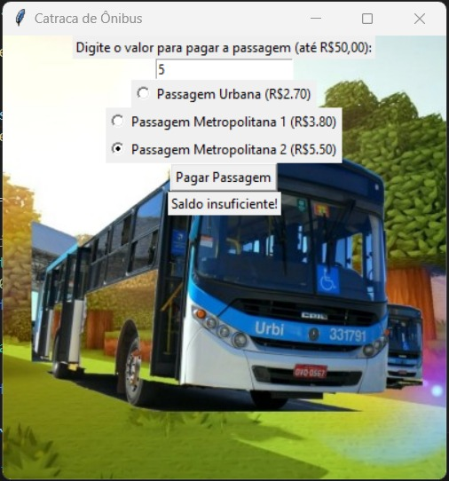
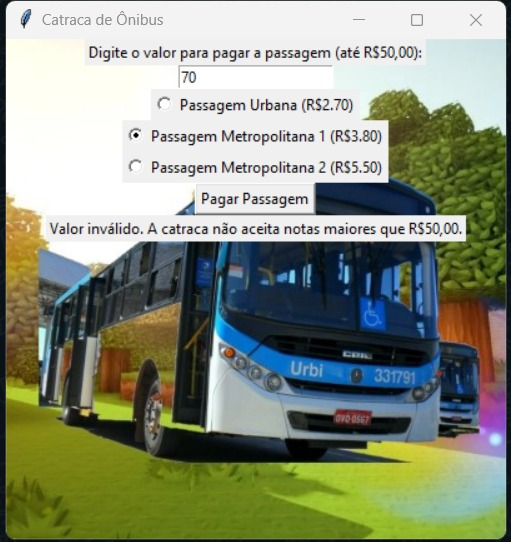
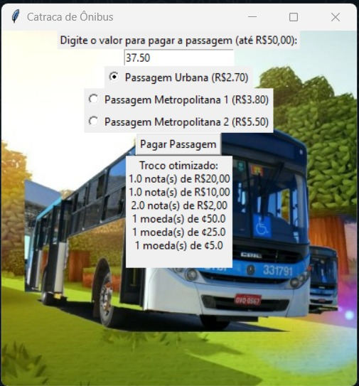

# Bus Ticket

**Número da Lista**: 10 
**Conteúdo da Disciplina**: Greed 

## Alunos
|Matrícula | Aluno |
| -- | -- |
| 20/0043536  |  Silas Neres de Souza|
| 20/2017521  |  Algusto Rodrigues Caldas |

## Sobre 
Programa que automatiza catracas de ônibus.

## Screenshots

Labirinto 1

Labirinto 2

Labirinto 3

## Instalação 
**Linguagem**: Python 
**Framework**: Tkinter e Pillow 
Necessário ter uma versão atualizada da linguagem Python (Preferência 3.10) e, além disso, instalar o framework tk e pillow (Use o comando: pip install). 
- pip install tk
- pip install pillow

## Uso 
Primeiro, use o terminal e use o comando "cd src", para entrar na pasta **src**. Agora, execute o programa e insira valores maiores que o da passagem desejada e menores que o valot teto (R$50,00), feito isso, clique em "Pagar passagem" para ver a opção de troco com melhor otimização de notas.

## Outros 
None
